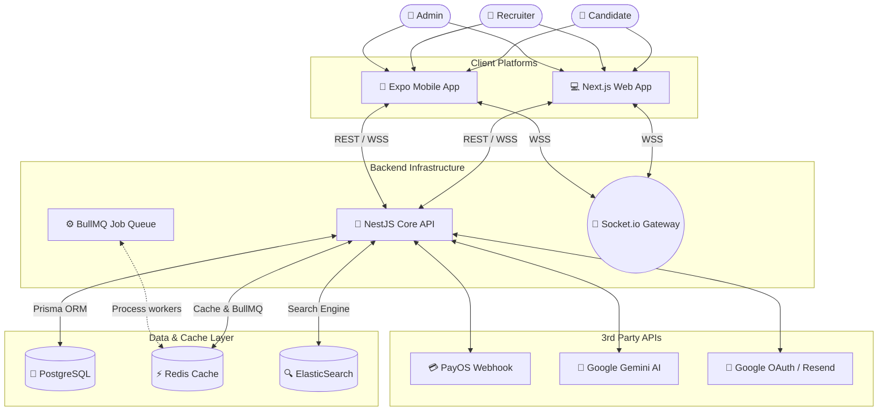

# 🚀 Workly System 

**Hệ thống Quản lý Tuyển dụng & Tìm kiếm Việc làm Tiên tiến dựa trên AI**

---

[Giới thiệu](#-tổng-quan-dự-án) •
[Kiến trúc](#-kiến-trúc-hệ-thống) •
[Dự án con](#-cấu-trúc-dự-án) •
[Khởi động](#-chi-tiết-các-phân-hệ) •
[Bản quyền](#-bản-quyền--giấy-phép)

## 📌 Tổng quan Hệ thống

**Workly** là một nền tảng tuyển dụng All-in-One được xây dựng chuẩn Enterprise theo mô hình Hệ thống đa nền tảng (Cloud Web + Mobile App). Phân hệ được thiết kế để kết nối và tự động hóa toàn bộ quy trình, với điểm nhấn mạnh nhất vào mảng phân tích Trí tuệ Nhân tạo (AI).

---

## 🌟 Hệ thống Tính năng Nổi bật (Core Features)

### 🤵 Trải nghiệm Ứng viên (Candidate) mượt mà
- **Tìm kiếm đa chiều đỉnh cao:** Dùng bộ máy tìm kiếm ElasticSearch để truy vấn công việc theo từ khoá, bằng cấp, và cả **Vị trí Bản đồ (Leaflet)** với tốc độ mili-giây.
- **AI Đọc & Phân tích CV:** Tự động sử dụng Google Gemini AI đọc tệp PDF để trích xuất kinh nghiệm và đưa ra đánh giá matching %, dự đoán cơ hội đậu phỏng vấn ngay trước khi nộp đơn.
- **Tính năng Social Login & Liên lạc thời gian thực:** Cho phép SSO (Google/LinkedIn) và tính năng trò chuyện Real-time Chat 1:1 với nhà tuyển dụng (WebSockets).

### 🏢 Hệ thống Quản trị dành cho Doanh nghiệp (HR / Recruiter)
- **Hệ sinh thái Thanh toán Hybrid (Pay-As-You-Go):** HR được sử dụng một "Ví diện tử" riêng (Nạp nội bộ qua cổng PayOS và Quét mã VietQR). Họ có thể mua các **Gói VIP (Growth/Lite)** theo tháng hoặc mua lẻ từng Block **"CV Hunter"** để mở khóa ứng viên theo nhu cầu linh hoạt, có chính sách marketing hoàn tiền.
- **Khu vực làm việc An toàn (Protected Workspace):** Quản lý hồ sơ ứng viên theo quy trình (Cột Kanban), đánh dấu trạng thái phỏng vấn tự động đẩy Notification bằng Email hoặc Realtime về điện thoại ứng viên.
- **Dashboard Data-Driven:** Biểu đồ hóa hiệu năng của các bài đăng tin VIP và BASIC, đi kèm với công cụ **AI Reporting** tự động phân tích độ hiệu quả để khuyên HR nạp thêm xu.

### 👑 Bảng điều khiển Tối cao (Supreme Admin)
- **Role-Based Access Control (RBAC):** Phân quyền hệ thống cực sát. Quản lý được phân hóa quyền cấp phép tạo mới Admin.
- **Moderation Workflow (Kiểm duyệt):** Tự động AI nhận diện ngôn từ độc hại để chặn tin rác. Mod có thể Suspend/Approve tin tuyển bài, khoá tài khoản có hành vi không minh bạch.
- **Live Revenue Tracking:** Hệ thống bảng tín hiệu biểu diễn số dòng tiền Nạp mới và Sử dụng của toàn bộ Doanh nghiệp với công nghệ truyền tải SSE/Socket không độ trễ.

---

## 🏗 Kiến trúc Hệ thống (System Architecture)

---

## 📂 Tổ chức mã nguồn (Monorepo)

Hệ thống được chia thành 3 phân hệ chính. **Mỗi phân hệ (thư mục) đều có một tài liệu `README.md` riêng** hướng dẫn chuyên sâu chi tiết.

| Phân hệ | Vai trò | Tech Stack chính |
|---------|---------|------------------|
| 📁 [**`server/`**](./server) | Core Backend API, xử lý nghiệp vụ, DB, Websocket | Node.js, NestJS v11, Prisma, PostgreSQL, Redis |
| 📁 [**`web-client/`**](./web-client) | Web App dành cho cả 3 tệp User (Admin, HR, Candidate) | Next.js 16, React 19, Tailwind CSS v4, Zustand |
| 📁 [**`mobile-app/`**](./mobile-app) | Ứng dụng Mobile đầy đủ tính năng cho cả 3 đối tượng (Admin, HR, Candidate) | React Native, Expo 54, Expo Router, Chart Kit |

> 👉 **Mẹo:** Nhấn vào đường dẫn của từng thư mục ở trên để vào đọc tài liệu chi tiết (Cách cấu hình `.env` cho web, cách debug mobile app, cách load Database...).

---

## ☁️ Quy trình Triển khai (Deployment)

Dự án này được thiết kế để dễ dàng CI/CD lên các nền tảng đám mây:
- **Web Client:** Khuyến nghị dùng **Vercel** (Bật tính năng Next.js App Router).
- **Server API:** Khuyến nghị dùng **Render** hoặc **AWS EC2/VPS** (Kèm theo Docker hoặc chạy node native).
- **PostgreSQL / Redis:** Có thể dùng **Supabase** (cho database) và **Upstash** (cho Redis).

---

## 📝 Bản quyền & Giấy phép

Được phát triển và kiến trúc bởi nhóm tác giả, hệ thống đang đặt dưới thiết lập **PRIVATE / UNLICENSED**. Chỉ sử dụng cho mục đích nội bộ và nghiên cứu. Nghiêm cấm sao chép thương mại khi chưa có sự cho phép.
